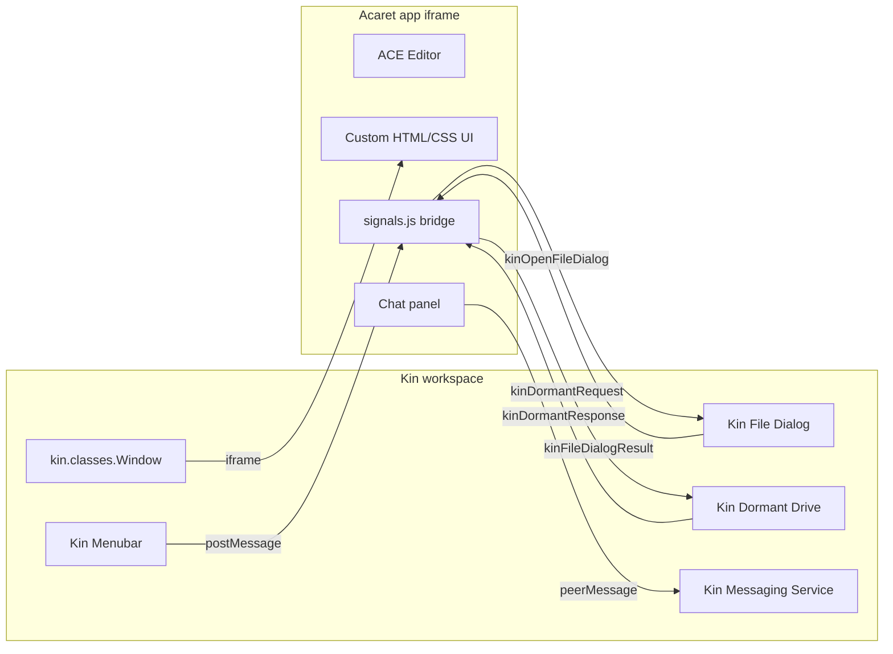

# Acaret architecture



## Components

### Entry point (`main.js`)
Standard Kin IIFE pattern that creates a `kin.classes.Window` pointing to `index.html`.

### HTML/UI (`index.html`, `styles/`)
Custom HTML layout with left sidebar (Editor, Shop, Flow nodes, AI tools, Version control, Project), right sidebar (Chat, Folders, Translations, Tags, Navigator), top toolbar (tabs), and bottom bar (status).

### Editor (`page-editor.js`)
ACE Editor integration — multi-tab editing, file type detection, syntax highlighting, preview mode.

### Kin bridge (`signals.js`)
PostMessage bridge between the app and Kin workspace:
- Registers menus via `kinAppRegisterMenus`
- Opens file dialogs via `kinOpenFileDialog`
- Reads/writes files via Kin HTTP APIs (`/api/file/read`, `/api/file/write`)
- Lists directories via `/api/dir`

### AI Chat (`conversation.js`, `conversation_logic.js`)
Chat with LLM. Currently uses direct Ollama HTTP calls; future integration will route through Kin messaging service.

### Pages
Each sidebar panel is a `page-*.js` file: chat, folders (Kin file browser), translations, tags, navigator (code outline), flow nodes, shop, version control.

## Kin APIs used

| API | Purpose |
|-----|---------|
| `kin.classes.Window` | Create app window with title, dimensions, quit-on-close |
| `postMessage({ kinAppRegisterMenus })` | Register File/Edit/Settings menus |
| `postMessage({ kinMenuCommand })` | Receive menu command dispatch |
| `postMessage({ kinOpenFileDialog })` | Open file open/save dialogs |
| `postMessage({ kinFileDialogResult })` | Receive dialog result |
| `POST /api/file/read` | Read file content |
| `POST /api/file/write` | Write file content |
| `POST /api/dir` | List directory contents |
| `kin.api.sendPeerMessage` | Send AI chat via messaging service |

## File structure

```
kin_acaret/
  manifest.json    # App descriptor
  main.js           # IIFE entry → kin.classes.Window
  index.html        # HTML UI template
  app.js            # ES module initializer
  js/               # App logic (page-*.js, conversation.js, signals.js)
  styles/           # CSS and images
  libs/ace/         # ACE editor
```
