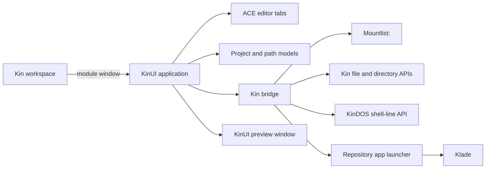

# Acaret architecture

## Components

- `main.js` opens the standard Kin module window.
- `ui.json` declares the toolbar, mounted-disk explorer, editor tabs, project tools, output, and status UI entirely with KinUI components.
- `app.mjs` coordinates ACE buffers, project lifecycle, lazy folder trees, templates, locale files, tags, navigation, preview, and execution.
- `bridge.mjs` owns authenticated Kin HTTP and app-launch operations.
- `kin-paths.mjs` owns `Volume:relative/path` parsing and explicitly has no slash root.
- `project-model.mjs` owns schema-2 descriptors, schema-1 migration, validation, and synchronization of the standard repository manifest metadata.

## Mounted disks and assigns

Acaret reads `Mountlist:` through the directory API. Every returned standard volume, custom disk, assign, shared volume, or Dormant drive is eligible for browsing. `Trash:` is a special virtual destination and `Mountlist:` is discovery, not a project location.

Volume names retain mountlist casing and compare case-insensitively. Paths sent to APIs are canonical KinDOS paths such as `Home:scripts/main.js` or `Work:Projects/demo/project.acaret`; POSIX forms such as `/Home:scripts` do not exist.

## Project descriptor

Schema 2 stores `schema`, `name`, `kind`, and project-relative `entry`. KinUI projects additionally store `packageId`, `category`, and project-relative `uiDocument`. Descriptor and root paths are runtime-only values derived from the descriptor's Kin path.

Schema-1 descriptors are accepted and completed from `manifest.json`, then upgraded when project settings are saved. Translations live in the application's real `locale/*.json` files rather than in `project.acaret`.
