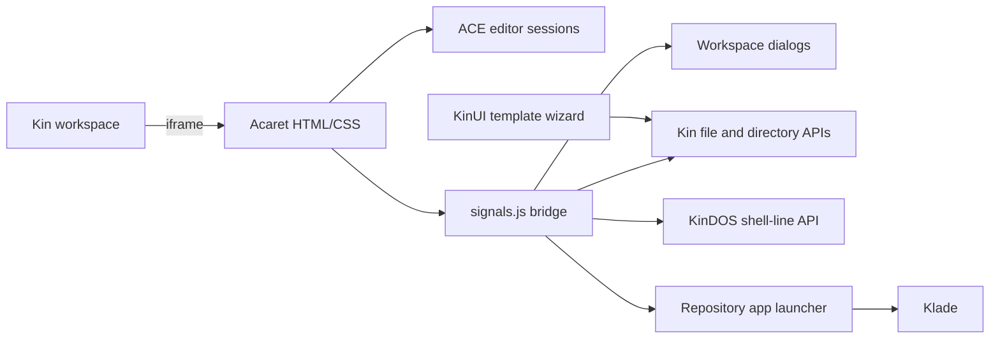

# Acaret architecture

## Components

- `main.js` creates the Kin window and loads the required application scripts in dependency order.
- `index.html` and `styles/main.css` implement the editor, project page, folder/tools rail, preview, and output panel.
- `page-editor.js` owns ACE sessions, canonical Kin paths, dirty state, Markdown preview, Klade handoff, and QuickJS execution output.
- `signals.js` is the only Kin bridge. It handles menus, dialogs, file/directory operations, Trash, app launch, and `/api/kindos/shell-line`.
- `page-project.js`, `template-wizard.js`, and `template-catalog.mjs` own schema-1 project descriptors and the three supported templates.
- `page-folders.js`, `page-translations.js`, `page-tags.js`, and `page-navigator.js` provide the retained workspace tools.

## Project descriptor

`project.acaret` stores `schema`, `name`, `kind`, `entry`, `languages`, and `languageKeys`. Runtime-only fields such as descriptor and root paths are derived when a project opens and are not serialized.
